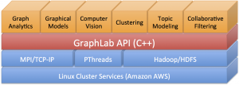

# GraphLab PowerGraph v2.2

## UPDATE: For a signficant evolution of this codebase, see GraphLab Create which is available for download at [turi.com](https://turi.com)

## History
In 2013, the team that created GraphLab PowerGraph started the Seattle-based company, GraphLab, Inc. The learnings from GraphLab PowerGraph and GraphChi projects have culminated into GraphLab Create, a enterprise-class data science platform for data scientists and software engineers that can simplify building and deploying advanced machine learning models as a RESTful predictive service. In January 2015, GraphLab, Inc. was renamed to Turi. See [turi.com](https://turi.com) for more information. 

## Status
GraphLab PowerGraph is no longer in active development by the founding team. GraphLab PowerGraph is now supported by the community at [http://forum.turi.com/](http://forum.turi.com/).  

# Introduction

GraphLab PowerGraph is a graph-based, high performance, distributed computation framework written in C++. 

The GraphLab PowerGraph academic project was started in 2009 at Carnegie Mellon University to develop a new parallel computation abstraction tailored to machine learning. GraphLab PowerGraph 1.0 employed shared-memory design. In GraphLab PowerGraph 2.1, the framework was redesigned to target the distributed environment. It addressed the difficulties with real-world power-law graphs and achieved unparalleled performance at the time. In GraphLab PowerGraph 2.2, the Warp System was introduced and provided a new flexible, distributed architecture around fine-grained user-mode threading (fibers). The Warp System allows one to easily extend the abstraction, to improve optimization for example, while also improving usability.

GraphLab PowerGraph is the culmination of 4-years of research and development into graph computation, distributed computing, and machine learning. GraphLab PowerGraph scales to graphs with billions of vertices and edges easily, performing orders of magnitude faster than competing systems. GraphLab PowerGraph combines advances in machine learning algorithms, asynchronous distributed graph computation, prioritized scheduling, and graph placement with optimized low-level system design and efficient data-structures to achieve unmatched performance and scalability in challenging machine learning tasks.

Related is GraphChi, a spin-off project separate from the GraphLab PowerGraph project. GraphChi was designed to run very large graph computations on just a single machine, by using a novel algorithm for processing the graph from disk (SSD or hard drive) enabling a single desktop computer (actually a Mac Mini) to tackle problems that previously demanded an entire cluster. For more information, see [https://github.com/GraphChi](https://github.com/GraphChi).

# License


GraphLab PowerGraph is released under the [Apache 2 license](http://www.apache.org/licenses/LICENSE-2.0.html).

If you use GraphLab PowerGraph in your research, please cite our paper:
```
    @inproceedings{Low+al:uai10graphlab,
      title = {GraphLab: A New Parallel Framework for Machine Learning},
      author = {Yucheng Low and
                Joseph Gonzalez and
                Aapo Kyrola and
                Danny Bickson and
                Carlos Guestrin and
                Joseph M. Hellerstein},
      booktitle = {Conference on Uncertainty in Artificial Intelligence (UAI)},
      month = {July},
      year = {2010}
    }
```

# Academic and Conference Papers

Joseph E. Gonzalez, Yucheng Low, Haijie Gu, Danny Bickson, and Carlos Guestrin (2012). "[PowerGraph: Distributed Graph-Parallel Computation on Natural Graphs](https://www.usenix.org/conference/osdi12/technical-sessions/presentation/gonzalez)." Proceedings of the 10th USENIX Symposium on Operating Systems Design and Implementation (OSDI '12).

Yucheng Low, Joseph Gonzalez, Aapo Kyrola, Danny Bickson, Carlos Guestrin and Joseph M. Hellerstein (2012). "[Distributed GraphLab: A Framework for Machine Learning and Data Mining in the Cloud](http://vldb.org/pvldb/vol5/p716_yuchenglow_vldb2012.pdf)." Proceedings of the VLDB Endowment (PVLDB).

Yucheng Low, Joseph Gonzalez, Aapo Kyrola, Danny Bickson, Carlos Guestrin, and Joseph M. Hellerstein (2010). "[GraphLab: A New Parallel Framework for Machine Learning](http://arxiv.org/pdf/1006.4990v1.pdf)." Conference on Uncertainty in Artificial Intelligence (UAI).

Li, Kevin; Gibson, Charles; Ho, David; Zhou, Qi; Kim, Jason; Buhisi, Omar; Brown, Donald E.; Gerber, Matthew, "[Assessment of machine learning algorithms in cloud computing frameworks](http://ieeexplore.ieee.org/xpl/articleDetails.jsp?reload=true&arnumber=6549501)", Systems and Information Engineering Design Symposium (SIEDS), 2013 IEEE, pp.98,103, 26-26 April 2013

[Towards Benchmarking Graph-Processing Platforms](http://sc13.supercomputing.org/sites/default/files/PostersArchive/post152.html). by Yong Guo (Delft University of Technology), Marcin Biczak (Delft University of Technology), Ana Lucia Varbanescu (University of Amsterdam), Alexandru Iosup (Delft University of Technology), Claudio Martella (VU University Amsterdam), Theodore L. Willke (Intel Corporation), in Super Computing 13

Aapo Kyrola, Guy Blelloch, and Carlos Guestrin (2012). "[GraphChi: Large-Scale Graph computation on Just a PC](https://www.usenix.org/conference/osdi12/technical-sessions/presentation/kyrola)." Proceedings of the 10th USENIX Symposium on Operating Systems Design and Implementation (OSDI '12).


# The Software Stack

The GraphLab PowerGraph project consists of a core API and a collection of high-performance machine learning and data mining toolkits built on top. The API is written in C++ and built on top of standard cluster and cloud technologies. Inter-process communication is accomplished over TCP-IP and MPI is used to launch and manage GraphLab PowerGraph programs. Each process is multithreaded to fully utilize the multicore resources available on modern cluster nodes. It supports reading and writing to both Posix and HDFS filesystems.



GraphLab PowerGraph has a large selection of machine learning methods already implemented (see /toolkits directory in this repo). You can also implement your own algorithms on top of the graph programming API (a certain degree of C++ knowledge is required).

GraphLab PowerGraph Feature Highlights
--------------------------------------

* **Unified multicore/distributed API:** write once run anywhere 

* **Tuned for performance:** optimized C++ execution engine leverages extensive multi-threading and asynchronous IO 

* **Scalable:** Run on large cluster deployments by intelligently placing data and computation 

* **HDFS Integration:** Access your data directly from HDFS 

* **Powerful Machine Learning Toolkits:** Tackle challenging machine learning problems with ease

## Building

The current version of GraphLab PowerGraph was tested on Ubuntu Linux 64-bit 10.04,  11.04 (Natty), 12.04 (Pangolin) as well as Mac OS X 10.7 (Lion) and Mac OS X 10.8 (Mountain Lion). It requires a 64-bit operating system.

# Dependencies

To simplify installation, GraphLab PowerGraph currently downloads and builds most of its required dependencies using CMake’s External Project feature. This also means the first build could take a long time.

There are however, a few dependencies which must be manually satisfied.

* On OS X: g++ (>= 4.2) or clang (>= 3.0) [Required]
  +  Required for compiling GraphLab.

* On Linux: g++ (>= 4.3) or clang (>= 3.0) [Required]
  +  Required for compiling GraphLab.

* *nix build tools: patch, make [Required]
   +  Should come with most Mac/Linux systems by default. Recent Ubuntu version will require to install the build-essential package.

* zlib [Required]
   +   Comes with most Mac/Linux systems by default. Recent Ubuntu version will require the zlib1g-dev package.

* Open MPI or MPICH2 [Strongly Recommended]
   + Required for running GraphLab distributed. 

* JDK 6 or greater [Optional]
   + Required for HDFS support 

## Satisfying Dependencies on Mac OS X

Installing XCode with the command line tools (in XCode 4.3 you have to do this manually in the XCode Preferences -&gt; Download pane), satisfies all of these dependencies.

## Satisfying Dependencies on Ubuntu

All the dependencies can be satisfied from the repository:

    sudo apt-get update
    sudo apt-get install gcc g++ build-essential libopenmpi-dev openmpi-bin default-jdk cmake zlib1g-dev git

# Downloading GraphLab PowerGraph

You can download GraphLab PowerGraph directly from the Github Repository. Github also offers a zip download of the repository if you do not have git.

The git command line for cloning the repository is:

    git clone https://github.com/graphlab-code/graphlab.git
    cd graphlab


# Compiling and Running

```
./configure
```

In the graphlabapi directory, will create two sub-directories, release/ and debug/ . cd into either of these directories and running make will build the release or the debug versions respectively. Note that this will compile all of GraphLab, including all toolkits. Since some toolkits require additional dependencies (for instance, the Computer Vision toolkit needs OpenCV), this will also download and build all optional dependencies.

We recommend using make’s parallel build feature to accelerate the compilation process. For instance:

```
make -j4
```

will perform up to 4 build tasks in parallel. When building in release/ mode, GraphLab does require a large amount of memory to compile with the heaviest toolkit requiring 1GB of RAM.

Alternatively, if you know exactly which toolkit you want to build, cd into the toolkit’s sub-directory and running make, will be significantly faster as it will only download the minimal set of dependencies for that toolkit. For instance:

```
cd release/toolkits/graph_analytics
make -j4
```

will build only the Graph Analytics toolkit and will not need to obtain OpenCV, Eigen, etc used by the other toolkits.

## Compilation Issues
If you encounter issues please post the following on the [GraphLab forum](http://forum.graphlab.com).

* detailed description of the problem you are facing
* OS and OS version
* output of uname -a
* hardware of the machine
* utput of g++ -v and clang++ -v
* contents of graphlab/config.log and graphlab/configure.deps

# Writing Your Own Apps

There are two ways to write your own apps.

* To work in the GraphLab PowerGraph source tree, (recommended)
* Install and link against Graphlab PowerGraph (not recommended)


## 1:  Working in the GraphLab PowerGraph Source Tree

This is the best option if you just want to try using GraphLab PowerGraph quickly. GraphLab PowerGraph
uses the CMake build system which enables you to quickly create
a C++ project without having to write complicated Makefiles. 

1. Create your own sub-directory in the apps/ directory. for example apps/my_app
   
2. Create a CMakeLists.txt in apps/my_app containing the following lines:

    project(GraphLab) 
    add_graphlab_executable(my_app [List of cpp files space separated]) 

3. Substituting the right values into the square brackets. For instance:

    project(GraphLab) 
    add_graphlab_executable(my_app my_app.cpp) 

4. Running "make" in the apps/ directory of any of the build directories 
should compile your app. If your app does not show up, try running

    cd [the GraphLab API directory]
    touch apps/CMakeLists.txt


## 2: Installing and Linking Against GraphLab PowerGraph

To install and use GraphLab PowerGraph this way will require your system
to completely satisfy all remaining dependencies, which GraphLab PowerGraph normally 
builds automatically. This path is not extensively tested and is 
**not recommended**

You will require the following additional dependencies
 - libevent (>=2.0.18)
 - libjson (>=7.6.0)
 - libboost (>=1.53)
 - libhdfs (required for HDFS support)
 - tcmalloc (optional)

Follow the instructions in the [Compiling] section to build the release/ 
version of the library. Then cd into the release/ build directory and 
run make install . This will install the following:

* include/graphlab.hpp
 +   The primary GraphLab header 
*  include/graphlab/...
 +   The folder containing the headers for the rest of the GraphLab library 
*  lib/libgraphlab.a
 +   The GraphLab static library.
    
Once you have installed GraphLab PowerGraph you can compile your program by running:

```
g++ -O3 -pthread -lzookeeper_mt -lzookeeper_st -lboost_context -lz -ltcmalloc -levent -levent_pthreads -ljson -lboost_filesystem -lboost_program_options -lboost_system -lboost_iostreams -lboost_date_time -lhdfs -lgraphlab hello_world.cpp
```
    
If you have compiled with MPI support, you will also need

   -lmpi -lmpi++ 
   
# Tutorials
See [tutorials](TUTORIALS.md)

# Datasets
The following are data sets links we found useful when getting started with GraphLab PowerGraph.

##Social Graphs
* [Stanford Large Network Dataset (SNAP)](http://snap.stanford.edu/data/index.html)
* [Laboratory for Web Algorithms](http://law.di.unimi.it/datasets.php)

##Collaborative Filtering
* [Million Song dataset](http://labrosa.ee.columbia.edu/millionsong/)
* [Movielens dataset GroupLens](http://grouplens.org/datasets/movielens/)
* [KDD Cup 2012 by Tencent, Inc.](https://www.kddcup2012.org/)
* [University of Florida sparse matrix collection](http://www.cise.ufl.edu/research/sparse/matrices/)

##Classification
* [Airline on time performance](http://stat-computing.org/dataexpo/2009/)
* [SF restaurants](http://missionlocal.org/san-francisco-restaurant-health-inspections/)

##Misc
* [Amazon Web Services public datasets](http://aws.amazon.com/datasets)
  
# Release Notes
##### **map_reduce_vertices/edges and transform_vertices/edges are not parallelized on Mac OS X**

These operations currently rely on OpenMP for parallelism.

On OS X 10.6 and earlier, gcc 4.2 has several OpenMP bugs and is not stable enough to use reliably.

On OS X 10.7, the clang
++ compiler does not yet support OpenMP.

##### **map_reduce_vertices/edges and transform_vertices/edges use a lot more processors than what was specified in –ncpus**

This is related to the question above. While there is a simple temporary solution (omp_set_num_threads), we intend to properly resolve the issue by not using openMP at all.

##### **Unable to launch distributed GraphLab when each machine has multiple network interfaces**

The communication initialization currently takes the first non-localhost IP address as the machine’s IP. A more reliable solution will be to use the hostname used by MPI.
