# Toolkits Overview

## Collaborative Filtering

The collaborative filtering toolkit provides tools to identify patterns of user interests and make targeted recommendations. Learn more about collaborative filtering [here.](http://en.wikipedia.org/wiki/Collaborative_Filter)

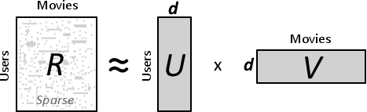

Most of the algorithms take the rating matrix R, which is a sparse matrix holding the rating given by users to movies, and builds a linear model, finding two low dimensional matrices

U and V s.t. their product approximates R: R ~ UV.

We implement multiple collaborative filtering algorithms: ALS (Alternating least squares), SGD (Stochastic Gradient Descent) , Bias SGD, Weighted-ALS, Sparse-ALS, SVD++.

## Clustering

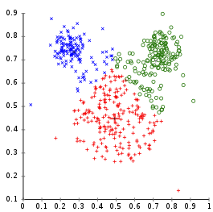

## KMeans++

GraphLab PowerGraph has a fast scalable implementation of the [Kmeans++](http://en.wikipedia.org/wiki/K-means%2B%2B) algorithm: a robust method of grouping datapoints into clusters.

## Computer Vision

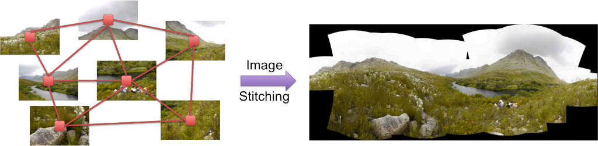

The Computer Vision Toolkit aims to provide fully distributed wrappers to algorithms in [OpenCV](http://opencv.org/ "OpenCV"), an open-source library aimed at real-time computer vision. Currently, the only implemented algorithm is Image-Stitching, where the goal is to create a composite panoramic image from a collection of images. Learn more about computer vision [here.](http://en.wikipedia.org/wiki/Computer_vision)

GraphLab PowerGraph Computer Vision Toolkit has become it’s own spin-off project called [CloudCV](http://cloudcv.org "CloudCV"), a comprehensive system that will aims to provide access to state-of-the-art computer vision algorithms on the cloud.

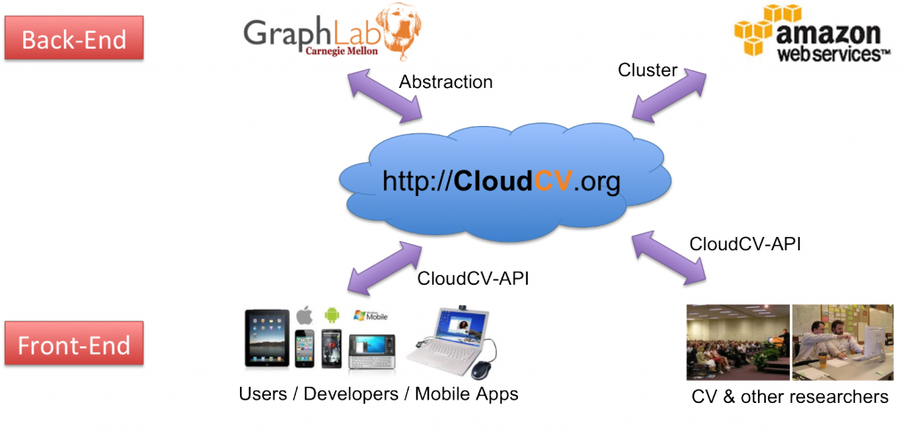

CloudCV: Large-Scale Parallel Computer Vision on the Cloud

## Graphical Models
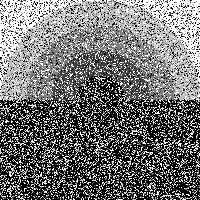
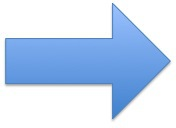
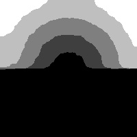

[Graphical models](http://en.wikipedia.org/wiki/Graphical_model) provide a compact interpretable representation of complex statistical phenomena by encoding random variables as vertices in a graph and relationships between those variables as edges. The Graphical Models toolkit provides a collection of methods to make predictions under uncertainty, and for reasoning about structured noisy data.

The main components of Graphical Models toolkit are:

1.  Distributed Dual Decomposition: performs maximum _a posteriori_ (MAP) inference in general [Markov Random Fields](http://en.wikipedia.org/wiki/Markov_random_field) via the Dual Decomposition algorithm. The MRF is assumed to be provided in the standard [UAI file format](http://www.cs.huji.ac.il/project/PASCAL/fileFormat.php). Maintained by [Dhruv Batra](http://filebox.ece.vt.edu/~dbatra/).
2.  [Structured Prediction](http://docs.graphlab.org/graphical_models.html): that applies the [Loopy Belief propagation (LBP)](http://en.wikipedia.org/wiki/Belief_propagation) algorithm to a pair-wise [Markov Random Field](http://en.wikipedia.org/wiki/Markov_random_field) encoding the classic [Potts Model](http://en.wikipedia.org/wiki/Potts_model).

## Graph Analytics

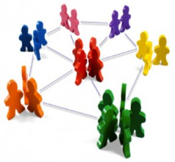

The Graph Analytics Toolkit aims to provide high performance, distributed tools for graph mining, for use in community detection, social network discovery, etc.

The toolkit currently implements the following tools:

### Triangle Counting
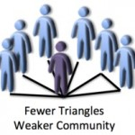
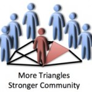

Two triangle counting program:

1.  **Undirected Triangle Counting**: counts the total number of triangles in a graph, or the the number of triangles each vertex is in
2.  **Directed Triangle Counting:** Counts the number of types of triangles each vertex is in

### PageRank

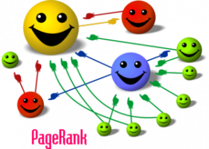

A classical graph algorithm which assigns each vertex a numerical importance value based on random walk properties. Learn more about page rank [here.](http://en.wikipedia.org/wiki/PageRank)

### KCore Decomposition

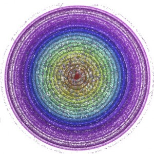

Identifies a hierarchical ordering of the vertices in the graph, allowing discovery of the central components of the network.

## Topic Modeling

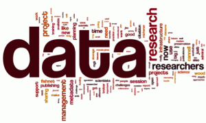

## Latent Dirichlet Allocation

The topic modelling toolbox currently implemented the [Latent Dirichlet Allocation](http://en.wikipedia.org/wiki/Latent_Dirichlet_allocation) algorithm for deriving semantic topic information from a corpus of plain text.

## Linear Solvers

GraphLab PowerGraph iterative solvers, for solving a linear system of the type Ax = b.

Currently [Jacobi method](http://en.wikipedia.org/wiki/Jacobi_method) is implemented.